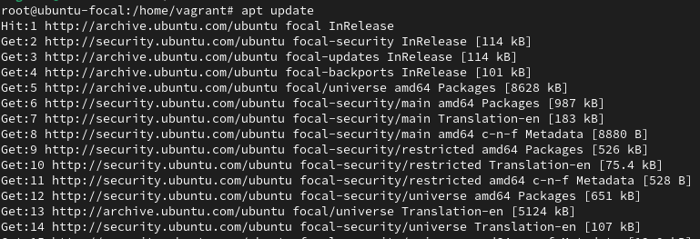
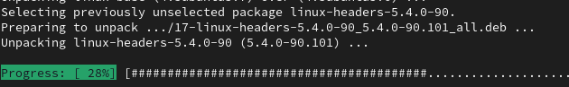
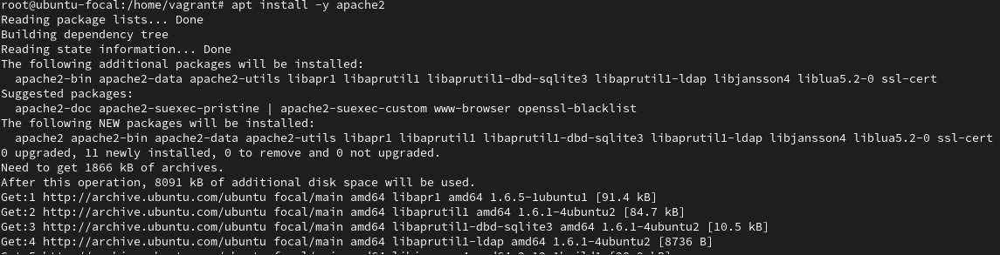

# Configuracion de OwnCloud

Primero instalamos el apache2 en la terminal. Pero primero debemso hacer apt update y apt upgrade de esta forma..

apt update

apt update

Y ahora si, instalamos el apache2

#Ponemos el comando "apt install -y apache2"

Y esperamos a que el apache 2 se acabe instalando..

A continuacion
