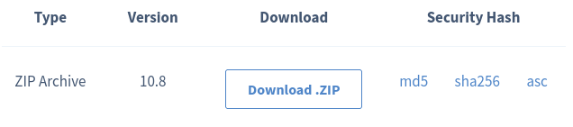
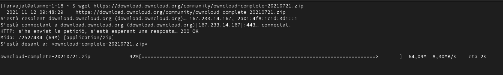
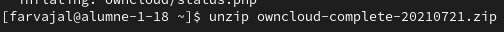

1# Instalación de OwnCloud

Primeramente para instalar OwnCloud, debemos de ir a la pagina web de OwnCloud: https://owncloud.com/

Seguidamente le damos a donde aparece "Discover OwnCloud"

Y a continuacion le damos a "Get started" para ir a donde se instala el OwnCloud...

Y seguimos con "See install options" para elegir diferentes opciones de instalacion..

Aqui como podeis ver, salen dos opciones; Descargarla como .zip o descargarla como

Para descargarlo, necesitamos tener la terminal abierta y copiar el enlace de el .zip, acompañado con antes un wget se instalará el OwnCloud y esperamos a que se nos instale...

Y finalmente lo unzipeamos con este siguiente comando..

Y ya estaría instalado el OwnCloud en nuestro equipo.
